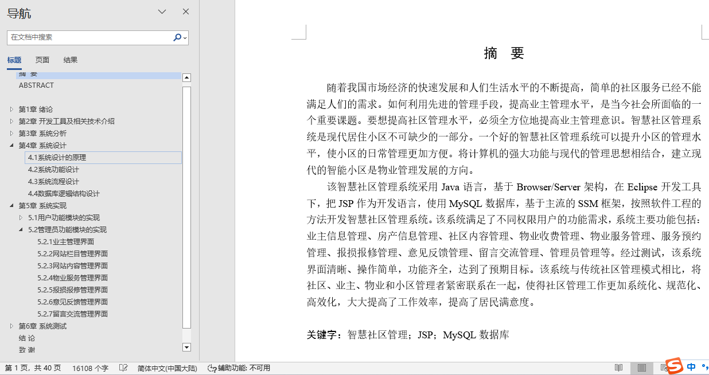
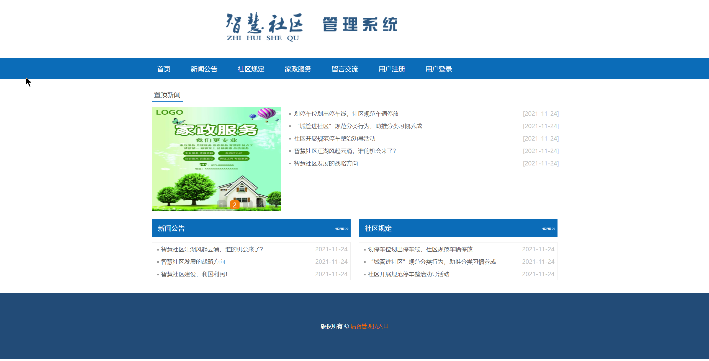
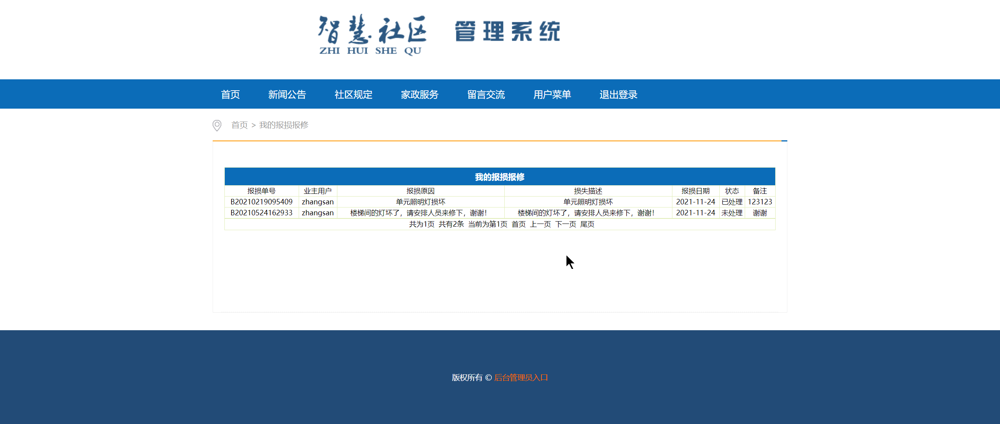
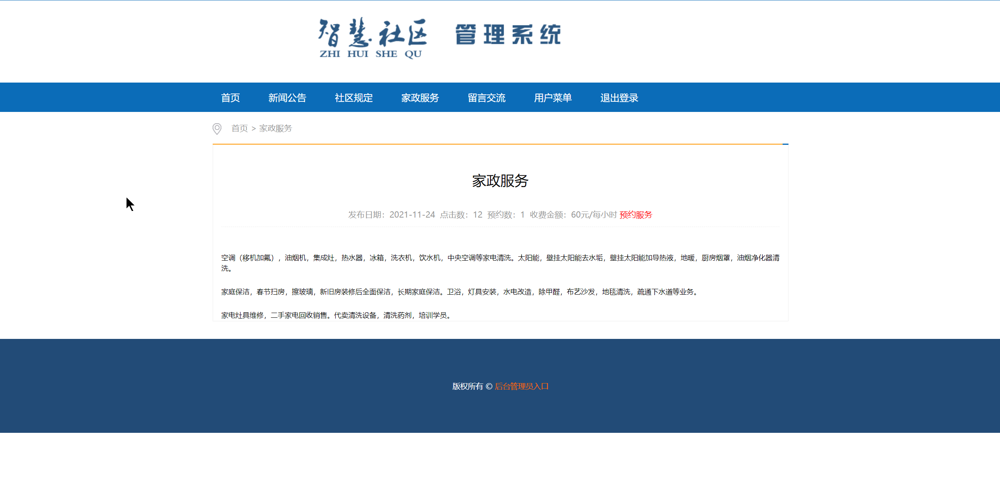
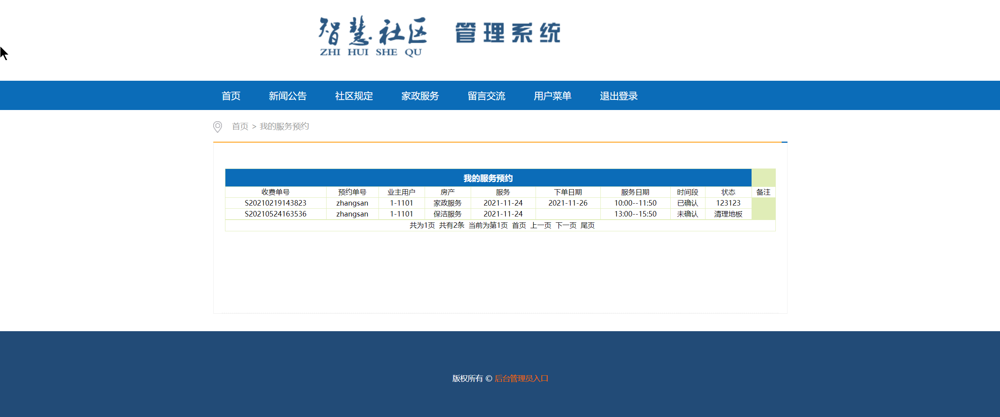
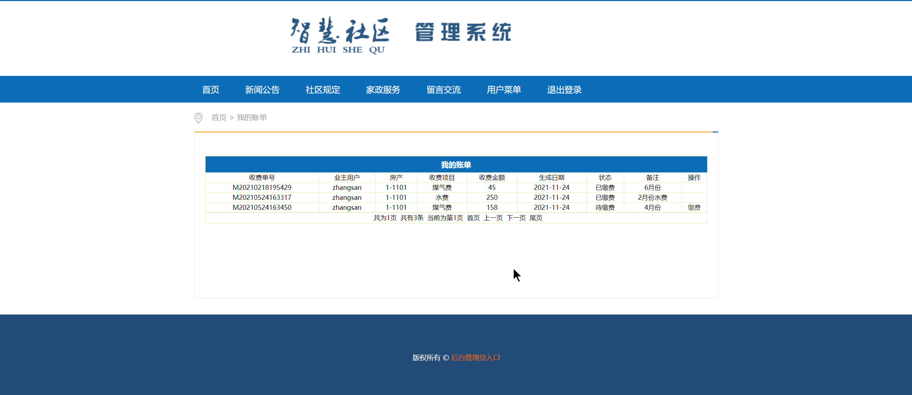
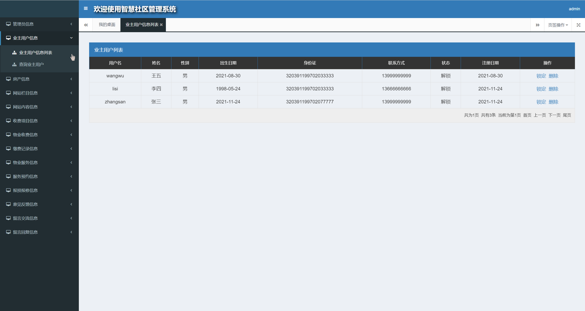
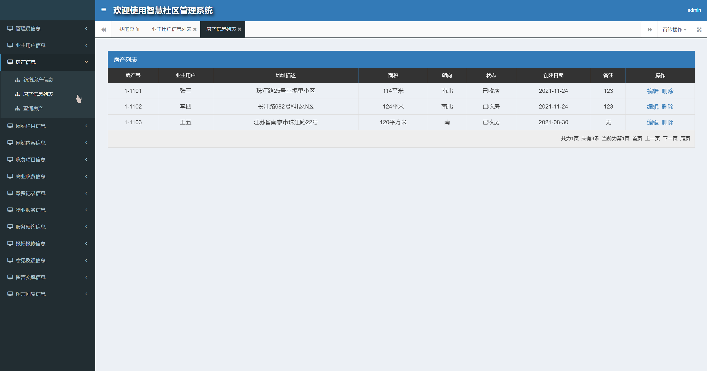

## 基于SSM框架的智慧社区管理系统(程序+报告)

###  获取sql数据库文件: 从戎源码网 (https://armycodes.com/) QQ: 386869957 QQ群: 377586148
###  所有系统地址: (https://github.com/YuLin-Coder/AllProjectCatalog) 
###  所有项目以及源代码本人均调试运行无问题 可支持远程安装部署调试、定制修改、代码讲解

## 项目介绍
基于SSM框架的智慧社区管理系统，系统包含两种角色：业主、管理员，主要分为前台和后台两大模块。
【业主】
首页、新闻公告展示、社区规定、家政服务预约、意见反馈、报损报修、我的房产信息、我的账单、留言交流、缴费记录
【管理员】
业主信息管理、房产信息管理、社区内容管理、物业收费管理、缴费记录信息管理、物业服务管理、服务预约管理、报损报修管理、意见反馈管理、留言交流管理、管理员管理等功能。

## 项目技术
- 编程语言：Java
- 数据库：MySQL
- 前端技术：JSP、Javascript、Bootstrap
- 后端技术：Spring、SpringMVC、MyBatis

## 运行环境
- JDK版本：JDK1.8及以上
- 开发工具：IDEA、Ecplise、Myecplise都可以
- 数据库: MySQL5.7及以上

## 运行截图

